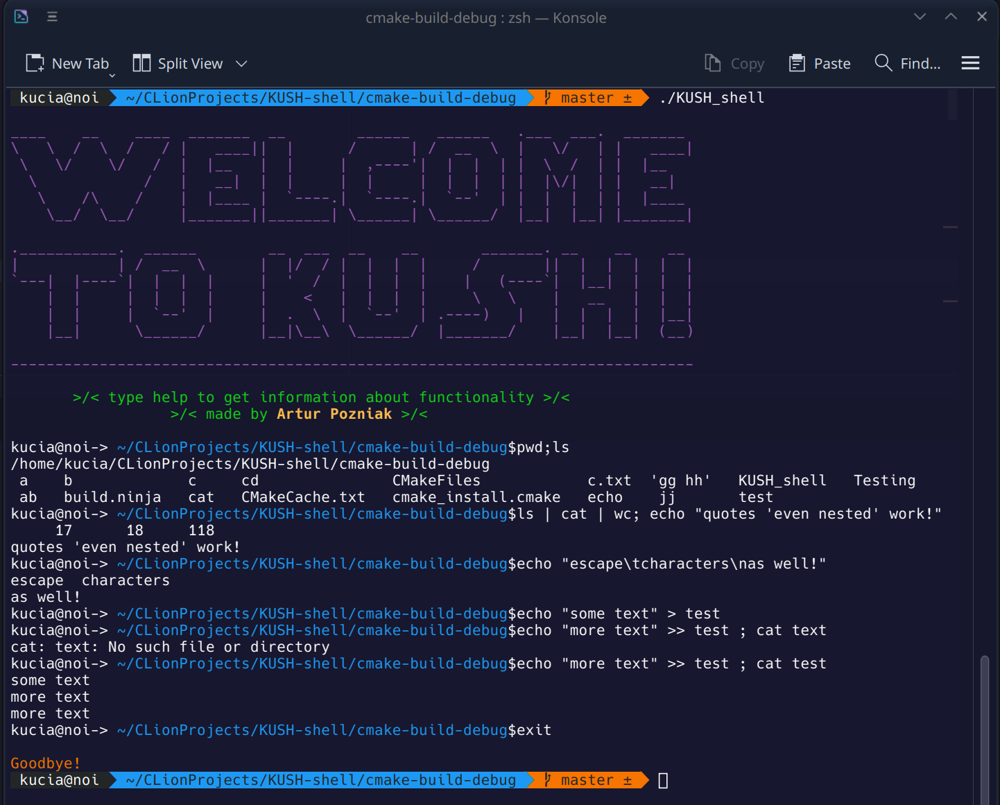

# KUSH 

It's a hand-written shell for UNIX operating systems (tested on Arch linux only btw) that supports and duplicates 
most of zsh features such as:
* input output redirections (multiple redirections as well)
* both double `"""` and single `''` quotes 
* history control via arrows
* autocompletion via tab
* colors support
* screen clearing (`clear` or `ctrl+L`)
* semicolons `;` for consequential command execution and pipes `|` same as they workin zsh
* escape characters
* errors highlighting

More details in `help`